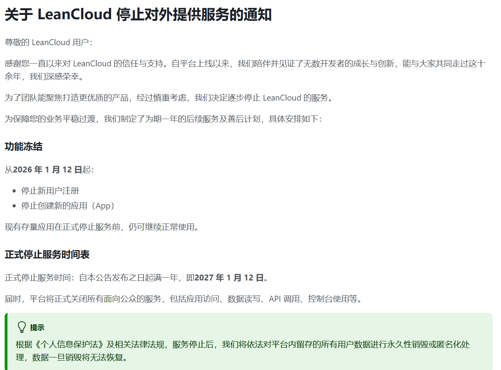

难得写点东西，结果一看，咦，评论系统咋又又又又又挂了。

Valine+LeanCloud用了有一阵子了，还挺稳定，除了LeanCloud时不时抽个风。

LeanCloud 将于 2027 年 1 月 12 日停止对外提供服务，详情请见[关于 LeanCloud 停止对外提供服务的通知 ](https://console.leancloud.cn/docs/sdk/announcements/sunset-announcement)。

<!--  -->


简直了。

又要我一番折腾。

[云函数部署 | Twikoo 文档](https://twikoo.js.org/backend.html#netlify-%E9%83%A8%E7%BD%B2)

本来想用gitalk，想着以后不用折腾这些云数据库。
结果，github似乎不支持gitlab的page。em。

twikoo本来想着搭配腾讯的CloudBase迅速搞定，结果各种免费版限制，就是配不起来，em，算球。
{"code":"OPERATION_FAIL","msg":"[ACCESS_TOKEN_DISABLED] 请升级 js sdk 到 2.0 及以上版本，并前往云开发控制台开启匿名登录 https://tcb.cloud.tencent.com/dev#/identity/login-manage） 更多错误信息请访问：https://docs.cloudbase.net/error-code/basic/ACCESS_TOKEN_DISABLED"}

mogodb好像之前注册过，不知道什么原因之前没配置，重新折腾一番。
netlify索性配置简单。
ok。
先用着，但是不想再换啊，历史数据倒来倒去也烦人。
虽然也没啥重要的。
可是不想手弄了呀，哈哈。
AI加油。
